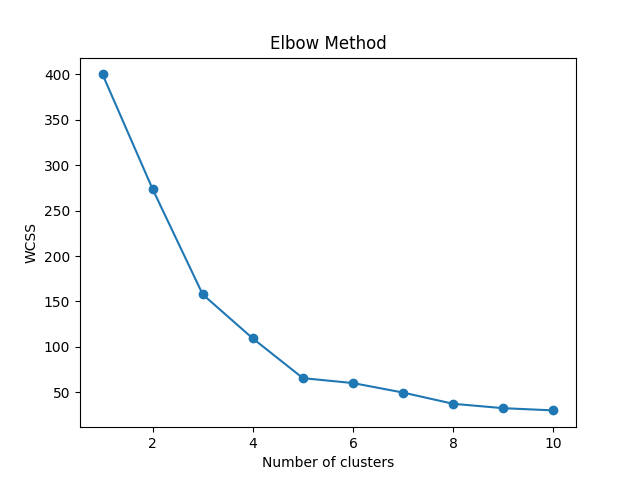

# 📊 Customer Segmentation using K-Means Clustering

This project applies **K-Means clustering** to segment customers based on their **Annual Income** and **Spending Score** using the Mall Customers dataset. The project also includes a Flask-based web interface for visualization and prediction.

---

## 🚀 Features

- 📈 Clusters customers based on spending habits
- 🧠 Trains a KMeans model and saves it as a `.pickle` file
- 🔧 Scales the data using `StandardScaler`
- 🖥️ Web interface built with **Flask**
- 📊 Visualizations using **Matplotlib**

---

## 📂 Project Structure

```
customer-segmentation/
│
├── Images/
│   ├── Figure_1.png
│   └── figure-2.png
│
├── templates/
│   └── index.html
│
├── Mall_Customers.csv
├── app.py
├── custoṁer_segmentation.py
├── kmeans_model.pickle
├── scaler.pickle
└── README.md
```

---

## 📌 Technologies Used

- Python
- Pandas, NumPy
- Scikit-learn
- Matplotlib
- Flask

---

## 📊 How It Works

1. **Load the dataset** (`Mall_Customers.csv`)
2. **Scale the features**
3. **Apply KMeans Clustering** (e.g., n=5 clusters)
4. **Visualize clusters**
5. **Save the model and scaler**
6. **Use Flask for a simple frontend to interact with the model**

---

## 🧪 How to Run Locally

1. **Clone the repository**
   ```bash
   git clone https://github.com/SamStephen007/customer-segementation-k-means-.git
   cd customer-segmentation
   ```

2. **Create a virtual environment** (optional but recommended)
   ```bash
   python -m venv venv
   source venv/bin/activate  # or venv\Scripts\activate on Windows
   ```

3. **Install dependencies**
   ```bash
   pip install -r requirements.txt
   ```

4. **Run the app**
   ```bash
   python app.py
   ```

5. Open your browser and go to: [http://localhost:5000](http://localhost:5000)

---

## 📷 Sample Output

Add images from your `Images/` folder here:



---

## 📁 Dataset

- Source: `Mall_Customers.csv`
- Columns used: `Annual Income (k$)` and `Spending Score (1-100)`

---

## ✅ Future Improvements

- Add more customer features (e.g., Age, Gender)
- Use interactive dashboards with Plotly/Dash
- Deploy to cloud (e.g., Render, Heroku)

---

## 📬 Contact

**Sam Stephen**  
📧 YourEmail@example.com  
🌐 [https://github.com/SamStephen007](https://github.com/SamStephen007)